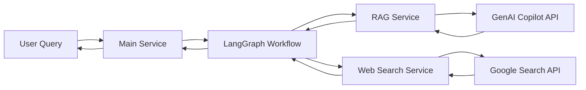
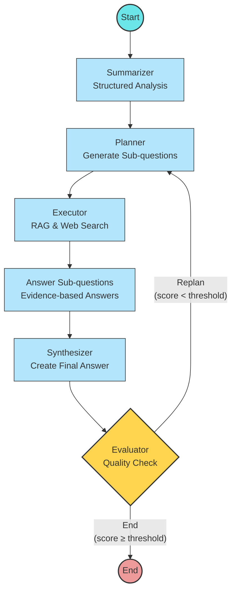

# AI Tools - Medical Agentic AI Research System

## Project Overview

This project implements a sophisticated Medical Agentic AI Research System that combines Retrieval-Augmented Generation (RAG), web search capabilities, and LangGraph-based workflow orchestration to provide evidence-based answers to medical questions.

The system breaks down complex medical queries into sub-questions, gathers evidence from both RAG systems and web searches, and synthesizes a final answer with citations to reliable sources.

## Architecture

The project is structured as a modular microservice-based architecture with the following components:

```
ai-tools/
    ├── README.md             # Project documentation
    ├── run_tests.py          # Test runner script
    ├── test-requirements.txt # Test dependencies
    ├── pytest.ini            # Pytest configuration
    ├── tests/                # Test directory
    │   ├── __init__.py       # Make tests a package
    │   ├── conftest.py       # Shared test fixtures
    │   ├── unit/             # Unit tests directory
    │   │   ├── test_app.py   # App tests
    │   │   ├── test_models/  # Model tests
    │   │   ├── test_routes/  # Route tests 
    │   │   ├── test_utils/   # Utility tests
    │   │   └── test_workflows/ # Workflow tests
    │   └── integration/      # Integration tests directory
    │       └── test_workflow_integration.py # End-to-end workflow tests
    └── backend/              # Backend services
        ├── app.py            # Main entry point and LangGraph workflow engine
        ├── config.py         # Configuration management
        ├── Rag_server.py     # RAG service with caching
        ├── websearch_server.py # Web search service
        ├── Main.py.backup    # Backup of main service
        ├── requirements.txt  # Python dependencies
        ├── pyproject.toml    # Project configuration
        ├── api/              # API definitions
        │   ├── __init__.py
        │   └── routes.py     # Common API routes
        ├── models/           # Data models
        │   ├── __init__.py
        │   ├── langgraph_models.py # LangGraph models
        │   ├── rag.py        # RAG service models
        │   └── websearch.py  # Web search models
        ├── routes/           # Route handlers
        │   ├── __init__.py
        │   ├── rag_routes.py  # RAG-specific routes
        │   └── websearch_routes.py # Web search-specific routes
        ├── utils/            # Utility functions
        │   ├── __init__.py
        │   ├── cache_utils.py # Caching utilities
        │   ├── http_utils.py  # HTTP utilities
        │   ├── logging_utils.py # Logging utilities
        │   └── web_utils.py   # Web processing utilities
        └── workflows/        # LangGraph workflows
            ├── __init__.py
            ├── agents.py     # Agent node definitions
            └── graph.py      # LangGraph workflow definitions
```

### System Flow Diagram




## Components

### 1. Main Service (app.py)

This is the core workflow engine built on LangGraph that orchestrates the entire question-answering process.

#### Workflow Graph

The LangGraph workflow consists of the following nodes and connections:



**Visualization Legend:**
- Blue Nodes: Processing steps that transform the query state
- Yellow Node: Decision point that determines workflow path
- Green Node: Entry point into the workflow
- Red Node: Exit point from the workflow

#### Node Functions

| Node | Description |
|------|-------------|
| `summarizer` | Creates a structured summary of the medical question |
| `planner` | Generates sub-questions to break down the main query |
| `executor` | Executes RAG and web searches to gather evidence |
| `answer_subqs` | Answers each sub-question using gathered evidence |
| `synthesizer` | Combines sub-answers into a final response with citations |
| `evaluator` | Evaluates the answer quality and decides to finish or replan |

#### State Management

The system maintains a `QueryState` that evolves as it progresses through the workflow nodes, tracking:
- Original question and summary
- Generated sub-questions
- Evidence from RAG and web searches
- Answers to each sub-question
- Final synthesized answer with citations
- Evaluation scores

### 2. RAG Service (Rag_server.py)

A FastAPI service that provides Retrieval-Augmented Generation capabilities with:
- In-memory caching to avoid repeated API calls
- JWT token authentication with automatic refresh
- Integration with external GenAI Copilot service

### 3. Web Search Service (websearch_server.py)

A FastAPI service that provides web search functionality:
- Integration with Google Custom Search API
- Filtering and formatting of search results
- Configurable search parameters

## API Endpoints

### Main Service Endpoints

| Endpoint | Method | Description |
|----------|--------|-------------|
| `/mcp/runLanggraph` | POST | Main entry point to run the complete agentic workflow |

### RAG Service Endpoints

| Endpoint | Method | Description |
|----------|--------|-------------|
| `/searchrag` | POST | Search using GenAI RAG with caching |

### Web Search Service Endpoints

| Endpoint | Method | Description |
|----------|--------|-------------|
| `/mcp/Websearch` | POST | Execute web search and return formatted results |
| `/status` | GET | Get server status and health information |

## Workflow Explanation

### Understanding LangGraph Implementation

#### What is LangGraph?

LangGraph is a framework for building stateful, multi-actor applications with LLMs. It allows us to:

1. Define a **directed graph** where nodes are functions that process state
2. Create **edges** between nodes to define the flow of execution
3. Use **conditional edges** to implement dynamic branching logic
4. Maintain **state** that evolves throughout the workflow

#### Key Elements in Our Implementation:

1. **StateGraph**:
   - Creates a graph that maintains a typed state (`QueryState`)
   - Passes this state between nodes as they execute

2. **Nodes**:
   - Python functions that take a state object and return an updated state
   - Each performs a specific task in our medical research workflow
   - Functions like `structured_summarizer`, `planner`, `executor`, etc.

3. **Edges**:
   - Direct connections between nodes (A → B)
   - Define the path that execution will follow
   - Created using `graph.add_edge("node1", "node2")`

4. **Conditional Edges**:
   - Decision points that determine the next node based on a condition
   - Use a routing function (`should_replan`) that returns a string key
   - Map these keys to different destination nodes

5. **Entry Point**:
   - The starting node for the workflow
   - Set using `graph.set_entry_point("summarizer")`

6. **END**:
   - Special node that signals workflow completion
   - Used in conditional edges to terminate the process

### LangGraph Node Connections and Data Flow

The system follows this workflow with data transformations at each step:

1. **Entry Point → summarizer**:
   - Input: Raw medical query from user
   - Process: Extracts condition, symptoms, tests/treatments, and core clinical goal
   - Output: Structured medical question summary

2. **summarizer → planner**:
   - Input: Structured medical summary
   - Process: Analyzes question to identify knowledge gaps and research needs
   - Output: 3-5 specific sub-questions to answer the main query

3. **planner → executor**:
   - Input: Set of sub-questions
   - Process: Parallel execution of RAG queries and web searches
   - Output: Evidence corpus with RAG answers and web search results

4. **executor → answer_subqs**:
   - Input: Evidence corpus and sub-questions
   - Process: Generates evidence-based answers for each sub-question with citations
   - Output: Collection of focused answers to sub-questions

5. **answer_subqs → synthesizer**:
   - Input: Individual sub-question answers and evidence
   - Process: Combines information into comprehensive answer with citations
   - Output: Synthesized final answer with source references

6. **synthesizer → evaluator**:
   - Input: Final answer, original question, and evidence
   - Process: Measures quality across coverage, grounding, and coherence metrics
   - Output: Quality scores and improvement recommendations

7. **Conditional Edge - Decision Point**: 
   - If quality scores < threshold: **evaluator → planner** (replan with feedback)
   - If quality scores ≥ threshold: **evaluator → END** (return final result)

8. **Loop Termination**:
   - The workflow will execute a maximum of `MAX_LOOPS` iterations
   - Each iteration improves answer quality based on evaluation feedback

### Parallel Processing

The system uses threading and queues to parallelize web searches and content processing, allowing it to efficiently gather and process evidence from multiple sources simultaneously.

### State Evolution Example

Below is an example of how the `QueryState` evolves through the workflow for a sample query about arthritis treatments:

```
Query: "What are the latest treatments for rheumatoid arthritis?"

► After summarizer:
  - Condition: Rheumatoid Arthritis
  - Symptoms: N/A
  - Tests/Treatments: Latest treatments needed
  - Core Clinical Goal: Identify current treatment options

► After planner:
  - Subqueries: [
      "What are the current first-line treatments for rheumatoid arthritis?",
      "What newer biologics are available for rheumatoid arthritis?",
      "Are there recent clinical trials for rheumatoid arthritis treatments?",
      "What non-pharmacological approaches are recommended for rheumatoid arthritis?"
    ]

► After executor:
  - RAG answer: [Comprehensive information about treatments from medical database]
  - Web results: [10 sources from medical websites with summaries]

► After answer_subqs:
  - Answers to subqueries with citations to specific sources

► After synthesizer:
  - Final answer with integrated information and numbered citations

► After evaluator:
  - Coverage score: 0.85
  - Grounding score: 0.9
  - Coherence score: 0.88
  - Overall score: 0.88
  - Decision: End (score above threshold)
```

## Pictorial View of LangGraph Implementation

The following pictorial representation shows the actual LangGraph implementation code and how nodes and edges are connected:

```
┌─────────────────────────── LangGraph Implementation ────────────────────────────┐
│                                                                                │
│  # Define the StateGraph with QueryState                                       │
│  graph = StateGraph(QueryState)                                                │
│                                                                                │
│  # Add all nodes to the graph                                                  │
│  graph.add_node("summarizer", structured_summarizer)                           │
│  graph.add_node("planner", planner)                                            │
│  graph.add_node("executor", executor)                                          │
│  graph.add_node("answer_subqs", answer_subquestions)                           │
│  graph.add_node("synthesizer", synthesizer)                                    │
│  graph.add_node("evaluator", evaluator)                                        │
│                                                                                │
│  # Define entry point                                                          │
│  graph.set_entry_point("summarizer")                                           │
│                                                                                │
│  # Add direct edges between nodes                                              │
│  graph.add_edge("summarizer", "planner")                                       │
│  graph.add_edge("planner", "executor")                                         │
│  graph.add_edge("executor", "answer_subqs")                                    │
│  graph.add_edge("answer_subqs", "synthesizer")                                 │
│  graph.add_edge("synthesizer", "evaluator")                                    │
│                                                                                │
│  # Add conditional edge with decision function                                 │
│  graph.add_conditional_edges(                                                  │
│      "evaluator",                                                              │
│      should_replan,                  # Decision function that returns "replan" │
│      {                               # or "end" based on quality score         │
│          "end": END,                                                           │
│          "replan": "planner"                                                   │
│      }                                                                         │
│  )                                                                             │
│                                                                                │
│  # Compile the graph for execution                                             │
│  compiled_graph = graph.compile()                                              │
└────────────────────────────────────────────────────────────────────────────────┘

                           ┌─────────┐
                           │ START   │
                           └────┬────┘
                                │
                                ▼
┌───────────────────────────────────────────────────────┐
│                     summarizer                        │
│  ┌─────────────────────────────────────────────────┐  │
│  │ def structured_summarizer(state):               │  │
│  │   # Analyze question & create structured format │  │
│  │   return state with updated summary             │  │
│  └─────────────────────────────────────────────────┘  │
└───────────────────────┬───────────────────────────────┘
                        │
                        ▼
┌───────────────────────────────────────────────────────┐
│                      planner                          │
│  ┌─────────────────────────────────────────────────┐  │
│  │ def planner(state):                             │  │
│  │   # Generate 3-5 subquestions                   │  │
│  │   return state with updated subqueries          │  │
│  └─────────────────────────────────────────────────┘  │
└───────────────────────┬───────────────────────────────┘
                        │
                        ▼
┌───────────────────────────────────────────────────────┐
│                     executor                          │
│  ┌─────────────────────────────────────────────────┐  │
│  │ async def executor(state):                      │  │
│  │   # Parallelize RAG and web searches            │  │
│  │   return state with web_results and rag_answer  │  │
│  └─────────────────────────────────────────────────┘  │
└───────────────────────┬───────────────────────────────┘
                        │
                        ▼
┌───────────────────────────────────────────────────────┐
│                   answer_subqs                        │
│  ┌─────────────────────────────────────────────────┐  │
│  │ def answer_subquestions(state):                 │  │
│  │   # Answer each subquery with evidence          │  │
│  │   return state with updated answers dict        │  │
│  └─────────────────────────────────────────────────┘  │
└───────────────────────┬───────────────────────────────┘
                        │
                        ▼
┌───────────────────────────────────────────────────────┐
│                    synthesizer                        │
│  ┌─────────────────────────────────────────────────┐  │
│  │ def synthesizer(state):                         │  │
│  │   # Combine answers into final response         │  │
│  │   return state with updated final_answer        │  │
│  └─────────────────────────────────────────────────┘  │
└───────────────────────┬───────────────────────────────┘
                        │
                        ▼
┌───────────────────────────────────────────────────────┐
│                     evaluator                         │
│  ┌─────────────────────────────────────────────────┐  │
│  │ def evaluator(state):                           │  │
│  │   # Calculate quality scores                    │  │
│  │   return state with updated scores              │  │
│  └─────────────────────────────────────────────────┘  │
└───────────────────────┬───────────────────────────────┘
                        │
             ┌──────────┴───────────┐
             │                      │
             ▼                      ▼
      ┌─────────────┐        ┌─────────────┐
      │  score ≥    │        │  score <    │
      │ threshold   │        │ threshold   │
      └──────┬──────┘        └──────┬──────┘
             │                      │
             ▼                      │
      ┌─────────────┐               │
      │     END     │               │
      └─────────────┘               │
                        ┌───────────┘
                        │
                        └─────────────┐
                                      │
                                      ▼
                             Back to planner for
                              another iteration


## Data Flow Visualization

The following diagram shows how data flows through the LangGraph nodes:

flowchart
    subgraph Input
        query[User Query]
    end
    
    subgraph "app.py - LangGraph Workflow"
        direction TB
        start([Start]) --> sum[Summarizer]
        sum --> plan[Planner]
        plan --> exec[Executor]
        
        subgraph "Parallel Processing"
            direction TB
            exec --> rag{RAG Query}
            exec --> web{Web Search}
            rag --> answ[Answer Subquestions]
            web --> answ
        end
        
        answ --> synth[Synthesizer]
        synth --> eval{Evaluator}
        eval -->|Score < Threshold| plan
        eval -->|Score >= Threshold| fin([End])
    end
    
    subgraph Output
        fin --> result[Final Answer with Citations]
    end
    
    query --> start
    
    subgraph "External Services"
        direction LR
        rag -.-> |API Call| ragserv[Rag_server.py]
        web -.-> |API Call| webserv[websearch_server.py]
        ragserv -.-> |GenAI Copilot| external[External APIs]
        webserv -.-> |Google Search| external
    end

```

## Features

- **Structured Question Analysis**: Breaks down complex medical questions into components
- **Evidence-Based Answers**: Uses both RAG and web search to gather supporting evidence
- **Source Citation**: Includes numbered references to sources in the final answer
- **Quality Evaluation**: Evaluates answers against coverage, grounding, and coherence metrics
- **Iterative Improvement**: Replans and refines answers until quality thresholds are met
- **Caching**: Avoids redundant API calls with in-memory caching
- **Token Refresh**: Automatically refreshes expired JWT tokens

## Configuration

The system uses environment variables for configuration:

```
# API Keys and Endpoints
GEMINI_API_KEY=your-gemini-key
GOOGLE_API_KEY=your-google-key
GOOGLE_CSE_ID=your-custom-search-id
GENAI_BASE_URL=https://your-genai-base-url
GENAI_CLIENT_ID=your-client-id
GENAI_CLIENT_SECRET=your-client-secret

# System Configuration
MIN_OVERALL=0.7
MAX_LOOPS=3
SUBQ_SEARCH_COUNT=5
MAX_SOURCES_FOR_CITATIONS=5
MAX_EVIDENCE_SNIPPETS=3

# Allowed Domains for Sources
ALLOWED_DOMAINS=nih.gov,cdc.gov,who.int
```

## Installation and Setup

1. Clone the repository:
```bash
git clone https://gitlab.coligomed.com/DHP/dhp-backend-service/ai-tools.git
cd ai-tools
```

2. Create and activate a virtual environment:
```bash
python -m venv backend/venv
# On Windows
backend\venv\Scripts\activate
# On Unix/MacOS
source backend/venv/bin/activate
```

3. Install dependencies:
```bash
pip install -r backend/requirements.txt
```

4. Set up environment variables:
```bash
# Create a .env file in the root directory
touch .env
# Add your configuration variables
```

5. Start the services:
```bash
# Start RAG server
python backend/Rag_server.py

# Start web search server
python backend/websearch_server.py

# Start main service
python backend/app.py
```

## Usage

Send a POST request to the main service:

```bash
curl -X POST "http://localhost:9001/mcp/runLanggraph" \
     -H "Content-Type: application/json" \
     -d '{"query": "What are the latest treatments for rheumatoid arthritis?", "end_user_id": "test-user"}'
```

## Testing Framework

The project includes a comprehensive testing framework to ensure all components work correctly:

### Test Structure

- **Unit Tests**: Tests individual components in isolation
  - **Model Tests**: Ensure data models behave correctly
  - **Route Tests**: Verify API endpoints handle requests properly
  - **Utility Tests**: Validate utility functions
  - **Workflow Tests**: Test individual LangGraph nodes

- **Integration Tests**: Test how multiple components work together
  - **Workflow Integration**: Test the complete LangGraph workflow

### Running Tests

Use the `run_tests.py` script to execute tests:

```bash
# Run all tests
python run_tests.py

# Run only unit tests
python run_tests.py --unit

# Run only integration tests
python run_tests.py --integration

# Generate coverage report
python run_tests.py --cov

# Generate HTML coverage report
python run_tests.py --cov --html

# Run tests in verbose mode
python run_tests.py --verbose

# Run a specific test file
python run_tests.py --file tests/unit/test_app.py
```

### Test Configuration

Tests use pytest fixtures defined in `conftest.py` to:
- Mock environment variables
- Create test clients for FastAPI services
- Mock HTTP requests and external services

## Contributing

Please follow these steps to contribute to the project:

1. Fork the repository
2. Create a feature branch
3. Commit your changes
4. Push to the branch
5. Create a new merge request

### Development Requirements

Install the development dependencies:

```bash
pip install -r test-requirements.txt
pip install -r backend/requirements.txt
```

### Coding Standards

- Write tests for all new features
- Ensure tests pass before submitting changes
- Follow PEP 8 style guidelines
- Use type annotations where appropriate

## License

Proprietary - All rights reserved
